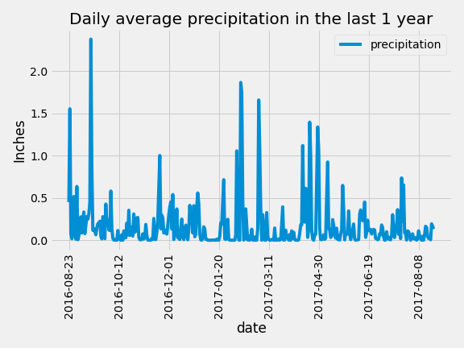
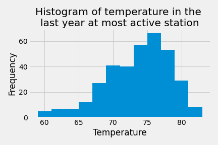
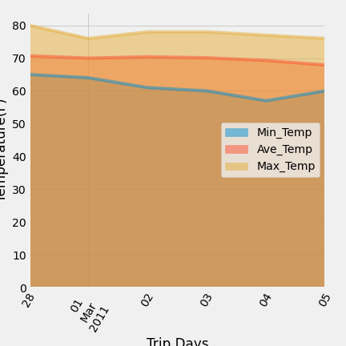

# SQLAlchemy Homework - Surfs Up!

### Precipitation Analysis

  The highest rainfall was recieved between August 2016 and October 2016

The table shows precipitation statistics

### Station Analysis

Whaihee station has the most obeservations as shown in the table below.

The Histogram below shows that the most days have a temperature around 75°F

- - -

## Step 2 - Climate App

* The following routes where created using Flask 

### Routes

* `/`
  * Home page.

* `/api/v1.0/precipitation`

* `/api/v1.0/stations`

* `/api/v1.0/tobs`

* `/api/v1.0/<start>` and `/api/v1.0/<start>/<end>`

- - -

## Part 3: Data Analyses

### Temperature Analysis I

* Average temperature in June at all stations across all available years in the dataset. 

 

* Average temperature in December at all stations across all available years in the dataset.

 

* The p-value of the test is 3.902513e-191, which is less than the significance level alpha (e.g., 0.05). This means that we can conclude that the Average Temperature in Hawai in June is statistically different from the Average Temperature in Hawai in December

 

### Temperature Analysis II

  

### Daily Rainfall Average

Daily normal rainfall for same days as holiday days

  

### Copyright

